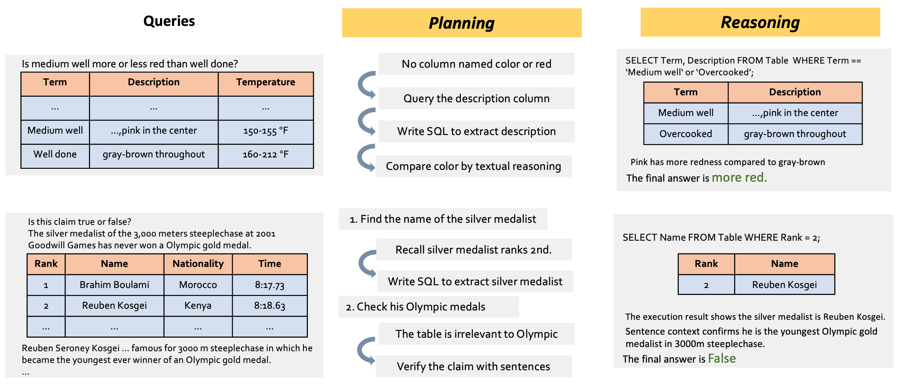

# ProTrix
Code and data for [ProTrix: Building Models for Planning and Reasoning over Tables with Sentence Context](https://arxiv.org/pdf/2403.02177.pdf)



## Introduction
We propose a *Plan-then-Reason* framework to answer user queries on tabular tasks with sentence context. The framework first plans the reasoning pathways by ingesting the query and the context, and assigns each step to textual and program-based reasoning to arrive at the final answer. We construct TrixInstruct, an instruction-tuning set to build models with generalizability and interpretability over tables with sentence context. We develop ProTrix, capable of planning and reasoning on tabular tasks with sentence context. ProTrix can generalize to unseen tasks generate accurate and faithful explanations.

## Updates
[2024/07/02] We add code for in-context learning experiments with our framework. Check the details in our [paper]((https://arxiv.org/pdf/2403.02177.pdf))!

[2024/05/21] We release our finetuned models on huggingface. We also introduce a new model Llama-3-ProTrix based on Llama-3-8B!

## Models
You can download our models [ProTrix](https://huggingface.co/pkupie/ProTrix), [ProTrix-Coder](https://huggingface.co/pkupie/ProTrix-Coder) and [Llama-3-ProTrix](https://huggingface.co/pkupie/Llama-3-ProTrix) on huggingface. The latest Llama-3-ProTrix is finetuned using [Xtuner](https://github.com/InternLM/xtuner).

## Environments
```
conda create --name protrix --file requirements.txt
```
We use [vllm](https://github.com/vllm-project/vllm) to speed up the inference. 
```
conda activate protrix
```
```
├── data
│   ├── evaluation_data
│   ├── gpt_output
│   └── TrixInstruct.json
├── evaluation
│   ├── compute_score.py
│   ├── evaluate_with_llm.py
│   ├── generate_all_responses.sh
│   ├── sql_tool.py
│   └── evaluate_with_sql.py
├── prompt
│   ├── one_step.py
│   ├── prompt.py
│   └── reason_after_sql.py
├── src
│   ├── utils
|   ├── eval_icl.py
│   ├── plan_then_reason.py
│   └── parse_output.py
├── README.md
└── requirement.txt
```
## Finetuning with Plan-then-Reason Framework
### Data Format of TrixInstruct
You can also download our [dataset](https://huggingface.co/datasets/pkupie/TrixInstruct) through Huggingface
```
{
    'id': instance id from the original dataset,
    'instruction': instruction for generation the responses,
    'output': response obtain from GPT-4,
    'answer': gold answer from the original dataset
}
```

### Inference
You can run the following command to generate result for a specific benchmark. We splits data on different GPUs to speed up the process with multiprocessing. The result will be saved at data/outputs/{model_name}. Use empty template for ProTrix and ProTrix-Coder, and llama3 template for Llama-3-ProTrix.
```
CUDA_VISIBLE_DEVICE={} python evaluation/evaluate_with_sql.py --model_path {your_path_to_protrix} --benchmark {benchmark} --template {template}
```
Or you can run the following command to generate for all the benchmarks in data/evaluation_data
```
cd evaluation
sh generate_all_responses.sh {protrix_path} {device}
```
This script will generate an approximation of the evaluation result. Note the template is set as llama3 by default. You can change it to empty for ProTrix and ProTrix-Coder.
### Evaluation
Since our model is not trained to follow the rule or grammar of each dataset, we provide two methods to compute the final score.

**Heuristic Matching Method**

We try to match the answer in the concluding sentence. This method is not perfect but there is only a tiny proporation of mismatch based on our human evaluation. We use this method for developing our model. We use this metric to report the final result of fact verification tasks in our paper.
```
python evaluation/compute_score.py --benchmark {benchmark} --model_path {model_path}
```
**LLM Method**

We employ Llama-2-70B-chat to access the correctness of the final answer. We use this method to report the final result of question answering tasks in our paper.
```
python evaluate_with_llm.py --benchmark {benchmark} --model_path {model_path} --llm_path {llm_path}
```
```
python compute_score.py --benchmark {benchmark} --model_path {model_path} --eval_with_llm
```

## In-Context Learning Method
You can run the following code to get responses from OpenAI APIs. To make fair comparisons, we use normalized data from previous SOTA [TabSQLify](https://github.com/mahadi-nahid/TabSQLify).
```
python src/plan_then_reason.py --model_name {model_name} --benchmark {benchmark} --step one_step --run
```
You can replace `--run` with `--dry_run` to test your prompt.

You can add argument `--end $num` to test code on first `$num` instances.
```
python src/parse_output.py --model_name {model_name} --benchmark {benchmark} --step one_step

python src/plan_then_reason.py --model_name {model_name} --benchmark {benchmark} --step one_step_result --run

python src/parse_output.py --model_name {model_name} --benchmark {benchmark} --step one_step_result
```
Now you can run the following code to evaluate the results of in-context learning. We use the same evaluator from [Binder](https://github.com/xlang-ai/Binder) to make fair comparison with existing prompting methods.
```
python src/eval_icl.py --model_name {model_name} --benchmark {benchmark} --one_step
```
## Citation 
```
@misc{wu2024protrix,
      title={ProTrix: Building Models for Planning and Reasoning over Tables with Sentence Context}, 
      author={Zirui Wu and Yansong Feng},
      year={2024},
      eprint={2403.02177},
      archivePrefix={arXiv},
      primaryClass={cs.CL}
}
```

## License
Check out the [license for our models](https://github.com/facebookresearch/llama/blob/main/LICENSE). Our curated dataset is under the MIT license.

## Acknowledgement
Our implementation for in-context learning is based on [Binder](https://github.com/xlang-ai/Binder) and [TabSQLify](https://github.com/mahadi-nahid/TabSQLify). We thank Rami Aly and Md Mahadi Hasan Nahid for helpful discussions.

## Contact
If you have any questions or want to discuss future research directions, feel free to email ziruiwu@pku.edu.cn.